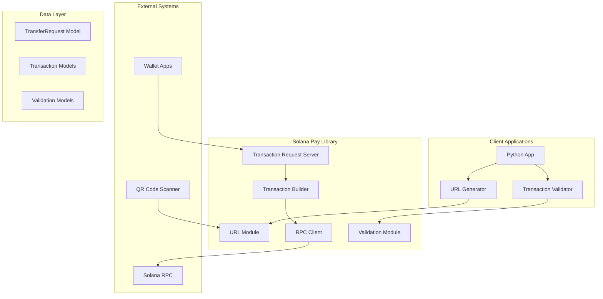

# Design Document

## Overview

The Solana Pay Python library provides a comprehensive implementation of the Solana Pay protocol, enabling Python developers to integrate cryptocurrency payments into their applications. The library follows a modular architecture with clear separation of concerns, supporting both client-side URL generation/parsing and server-side transaction processing.

The design prioritizes SPEC compliance, type safety, async operations, and interoperability with the existing Solana Pay ecosystem. The implementation uses modern Python patterns with Pydantic for data validation, solders/solana-py for blockchain interactions, and FastAPI for server components.

## Architecture

### High-Level Architecture



### Module Structure

```
solanapay/
├── __init__.py              # Public API exports
├── version.py               # Version information
├── urls.py                  # URL encoding/parsing (M1)
├── models/                  # Data models and schemas
│   ├── __init__.py
│   ├── transfer.py          # TransferRequest and related models
│   ├── transaction.py       # Transaction-related models
│   └── validation.py        # Validation result models
├── tx_builders/             # Transaction construction (M2)
│   ├── __init__.py
│   ├── transfer.py          # SOL/SPL transfer transactions
│   ├── memo.py              # Memo instruction utilities
│   └── references.py        # Reference handling utilities
├── server/                  # Transaction Request server (M3)
│   ├── __init__.py
│   ├── api.py               # FastAPI endpoints
│   ├── schemas.py           # Request/response schemas
│   └── middleware.py        # CORS, error handling
├── validation/              # Transaction validation (M4)
│   ├── __init__.py
│   ├── confirm.py           # Transaction confirmation
│   ├── references.py        # Reference validation
│   └── amounts.py           # Amount/balance validation
├── utils/                   # Shared utilities
│   ├── __init__.py
│   ├── ata.py               # Associated Token Account utilities
│   ├── decimal.py           # Decimal handling utilities
│   ├── rpc.py               # RPC client management
│   └── errors.py            # Custom exception classes
└── config/                  # Configuration management
    ├── __init__.py
    ├── clusters.py          # Cluster configurations
    └── settings.py          # Library settings
```

## Components and Interfaces

### Core Data Models

#### TransferRequest Model
```python
@dataclass
class TransferRequest:
    """Core model representing a Solana Pay transfer request."""
    recipient: str                    # Base58 public key
    amount: Optional[Decimal] = None  # Payment amount
    spl_token: Optional[str] = None   # SPL token mint address
    references: Optional[List[str]] = None  # Reference public keys
    label: Optional[str] = None       # Human-readable label
    message: Optional[str] = None     # Payment description
    memo: Optional[str] = None        # On-chain memo
    
    def validate(self) -> None:
        """Validate all fields according to SPEC requirements."""
        
    def to_url(self) -> str:
        """Generate solana: URL from this request."""
        
    @classmethod
    def from_url(cls, url: str) -> 'TransferRequest':
        """Parse URL into TransferRequest."""
```

#### Transaction Models
```python
@dataclass
class TransactionBuildResult:
    """Result of transaction building operation."""
    transaction: str              # Base64 encoded transaction
    signers_required: List[str]   # Required signer public keys
    instructions_count: int       # Number of instructions
    estimated_fee: int           # Estimated transaction fee in lamports
    
@dataclass
class ValidationResult:
    """Result of transaction validation."""
    is_valid: bool
    recipient_match: bool
    amount_match: bool
    memo_match: bool
    references_match: bool
    errors: List[str]
    confirmation_status: str  # processed, confirmed, finalized
```

### URL Module Interface

```python
class URLEncoder:
    """Handles Solana Pay URL encoding with SPEC compliance."""
    
    @staticmethod
    def encode(request: TransferRequest) -> str:
        """Generate solana: URL from TransferRequest."""
        
    @staticmethod
    def encode_https(request: TransferRequest, base_url: str) -> str:
        """Generate https: URL for transaction request discovery."""

class URLParser:
    """Handles Solana Pay URL parsing with validation."""
    
    @staticmethod
    def parse(url: str) -> TransferRequest:
        """Parse solana: or https: URL into TransferRequest."""
        
    @staticmethod
    def validate_url(url: str) -> bool:
        """Validate URL format without full parsing."""
```

### Transaction Builder Interface

```python
class TransactionBuilder:
    """Builds Solana transactions for payment processing."""
    
    def __init__(self, rpc_client: AsyncClient):
        self.rpc = rpc_client
        
    async def build_transfer(
        self,
        payer: str,
        request: TransferRequest,
        options: Optional[TransactionOptions] = None
    ) -> TransactionBuildResult:
        """Build transfer transaction from request."""
        
    async def build_sol_transfer(
        self,
        payer: Pubkey,
        recipient: Pubkey,
        amount: Decimal,
        memo: Optional[str] = None,
        references: List[Pubkey] = None
    ) -> VersionedTransaction:
        """Build SOL transfer transaction."""
        
    async def build_spl_transfer(
        self,
        payer: Pubkey,
        recipient: Pubkey,
        amount: Decimal,
        mint: Pubkey,
        memo: Optional[str] = None,
        references: List[Pubkey] = None
    ) -> VersionedTransaction:
        """Build SPL token transfer transaction."""

@dataclass
class TransactionOptions:
    """Options for transaction building."""
    priority_fee: Optional[int] = None
    auto_create_ata: bool = True
    use_versioned_tx: bool = True
    compute_unit_limit: Optional[int] = None
```

### Server Interface

```python
class TransactionRequestServer:
    """FastAPI server for transaction request handling."""
    
    def __init__(
        self,
        rpc_endpoint: str,
        merchant_config: MerchantConfig
    ):
        self.app = FastAPI()
        self.setup_routes()
        
    async def get_transaction_metadata(self) -> TransactionMetadata:
        """GET /tx - Return transaction metadata."""
        
    async def create_transaction(
        self,
        request: TransactionRequest
    ) -> TransactionResponse:
        """POST /tx - Create transaction for wallet."""

@dataclass
class MerchantConfig:
    """Configuration for merchant transaction requests."""
    label: str
    icon: Optional[str] = None
    recipient: str
    default_amount: Optional[Decimal] = None
    spl_token: Optional[str] = None
```

### Validation Interface

```python
class TransactionValidator:
    """Validates completed transactions against expected parameters."""
    
    def __init__(self, rpc_client: AsyncClient):
        self.rpc = rpc_client
        
    async def wait_and_verify(
        self,
        signature: str,
        expected: TransferRequest,
        timeout: int = 60,
        commitment: str = "confirmed"
    ) -> ValidationResult:
        """Wait for transaction confirmation and validate."""
        
    async def validate_transaction(
        self,
        signature: str,
        expected: TransferRequest
    ) -> ValidationResult:
        """Validate existing transaction against expected parameters."""
        
    async def check_references(
        self,
        transaction: dict,
        expected_references: List[str]
    ) -> bool:
        """Validate reference accounts in transaction."""
```

## Data Models

### Request/Response Schemas

```python
# Server API Schemas
class TransactionRequest(BaseModel):
    """POST /tx request schema."""
    account: str  # Payer public key from wallet
    
class TransactionResponse(BaseModel):
    """POST /tx response schema."""
    transaction: str  # Base64 encoded transaction
    message: Optional[str] = None
    
class TransactionMetadata(BaseModel):
    """GET /tx response schema."""
    label: str
    icon: Optional[str] = None

# Internal Models
class ClusterConfig(BaseModel):
    """Solana cluster configuration."""
    name: str
    rpc_endpoint: str
    ws_endpoint: Optional[str] = None
    
class LibrarySettings(BaseModel):
    """Global library settings."""
    default_cluster: str = "devnet"
    default_timeout: int = 60
    default_commitment: str = "confirmed"
    enable_logging: bool = False
    log_level: str = "INFO"
```

## Error Handling

### Exception Hierarchy

```python
class SolanaPayError(Exception):
    """Base exception for all Solana Pay errors."""
    pass

class URLError(SolanaPayError):
    """URL encoding/parsing errors."""
    pass

class TransactionBuildError(SolanaPayError):
    """Transaction building errors."""
    pass

class ValidationError(SolanaPayError):
    """Transaction validation errors."""
    pass

class RPCError(SolanaPayError):
    """RPC communication errors."""
    pass

class ConfigurationError(SolanaPayError):
    """Configuration and setup errors."""
    pass
```

### Error Handling Strategy

1. **Input Validation**: Validate all inputs at API boundaries with descriptive error messages
2. **RPC Error Handling**: Distinguish between network errors, RPC errors, and blockchain errors
3. **Graceful Degradation**: Provide fallback behavior where possible
4. **Error Context**: Preserve error context through exception chaining
5. **Logging**: Log errors at appropriate levels with structured data

## Testing Strategy

### Unit Testing Approach

```python
# Test Structure
tests/
├── unit/
│   ├── test_urls.py           # URL encoding/parsing tests
│   ├── test_transaction_builder.py  # Transaction building tests
│   ├── test_validation.py     # Validation logic tests
│   └── test_models.py         # Data model tests
├── integration/
│   ├── test_server.py         # FastAPI server tests
│   ├── test_rpc_integration.py  # RPC integration tests
│   └── test_end_to_end.py     # Full workflow tests
├── fixtures/
│   ├── transactions.py       # Sample transaction data
│   ├── urls.py               # Sample URL data
│   └── rpc_responses.py      # Mock RPC responses
└── conftest.py               # Pytest configuration
```

### Testing Patterns

1. **Vectorized Testing**: Use parameterized tests for boundary conditions and edge cases
2. **Mock RPC Responses**: Mock Solana RPC responses for consistent unit testing
3. **Integration Testing**: Test against live devnet for real-world validation
4. **Property-Based Testing**: Use hypothesis for URL encoding/parsing round-trip tests
5. **Performance Testing**: Benchmark critical operations like transaction building

### Test Data Management

```python
@dataclass
class TestVectors:
    """Test vectors for comprehensive testing."""
    valid_urls: List[Tuple[str, TransferRequest]]
    invalid_urls: List[Tuple[str, str]]  # URL, expected error
    valid_transactions: List[dict]
    invalid_amounts: List[Tuple[str, str]]  # Amount, expected error
    
# Example test vectors
VALID_URLS = [
    ("solana:9WzDXwBbmkg8ZTbNMqUxvQRAyrZzDsGYdLVL9zYtAWWM?amount=0.01", 
     TransferRequest(recipient="9WzDXwBbmkg8ZTbNMqUxvQRAyrZzDsGYdLVL9zYtAWWM", amount=Decimal("0.01"))),
    # ... more test cases
]
```

## Configuration and Deployment

### Configuration Management

```python
class SolanaPayConfig:
    """Central configuration management."""
    
    def __init__(self):
        self.clusters = {
            "devnet": ClusterConfig(
                name="devnet",
                rpc_endpoint="https://api.devnet.solana.com",
                ws_endpoint="wss://api.devnet.solana.com"
            ),
            "testnet": ClusterConfig(
                name="testnet", 
                rpc_endpoint="https://api.testnet.solana.com",
                ws_endpoint="wss://api.testnet.solana.com"
            ),
            "mainnet": ClusterConfig(
                name="mainnet-beta",
                rpc_endpoint="https://api.mainnet-beta.solana.com",
                ws_endpoint="wss://api.mainnet-beta.solana.com"
            )
        }
        
    def get_cluster(self, name: str) -> ClusterConfig:
        """Get cluster configuration by name."""
        
    def set_custom_cluster(self, name: str, config: ClusterConfig):
        """Add custom cluster configuration."""
```

### Environment Configuration

```python
# Environment variables support
SOLANA_PAY_CLUSTER = "devnet"  # Default cluster
SOLANA_PAY_RPC_ENDPOINT = ""   # Custom RPC endpoint
SOLANA_PAY_TIMEOUT = "60"      # Default timeout
SOLANA_PAY_LOG_LEVEL = "INFO"  # Logging level
```

## Performance Considerations

### Optimization Strategies

1. **Connection Pooling**: Reuse HTTP connections for RPC calls
2. **Async Operations**: Use async/await throughout for better concurrency
3. **Caching**: Cache mint decimals and account info where appropriate
4. **Batch Operations**: Support batch RPC calls where possible
5. **Lazy Loading**: Load heavy dependencies only when needed

### Resource Management

```python
class RPCManager:
    """Manages RPC connections with pooling and retry logic."""
    
    def __init__(self, endpoint: str, max_connections: int = 10):
        self.endpoint = endpoint
        self.pool = ConnectionPool(max_connections)
        
    async def __aenter__(self):
        return self
        
    async def __aexit__(self, exc_type, exc_val, exc_tb):
        await self.pool.close()
```

## Security Considerations

### Input Validation
- Validate all public keys using base58 decoding
- Sanitize URL parameters to prevent injection attacks
- Validate decimal amounts to prevent overflow/underflow

### Transaction Security
- Use versioned transactions (v0) for better security
- Validate all transaction parameters before signing
- Implement proper error handling to avoid information leakage

### Server Security
- Implement CORS policies for web applications
- Rate limiting for transaction request endpoints
- Input sanitization for all API endpoints
- Secure handling of sensitive configuration data

This design provides a solid foundation for implementing the Solana Pay Python library with proper separation of concerns, type safety, and extensibility for future enhancements.